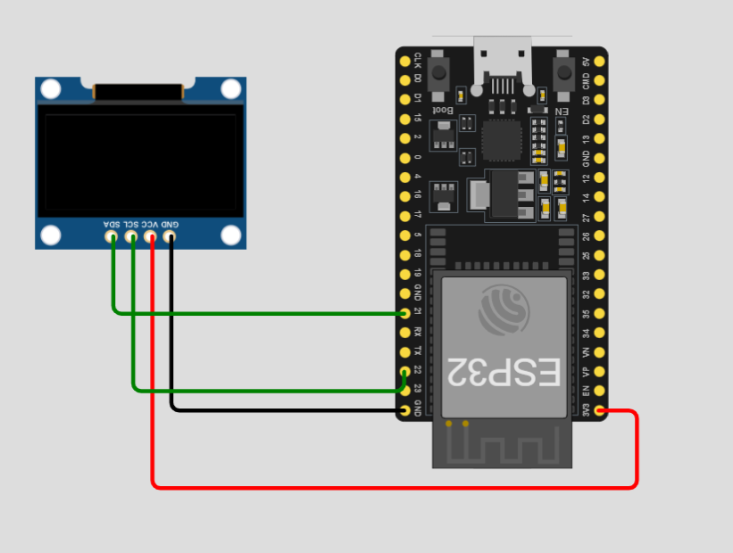

# SignBoard ✍️

Draw a signature or write text on an iPad, and watch it appear on a 128×64 SSD1306 OLED driven by an ESP32 in real time.

\`\`\`text
 iPad Safari                                ESP32                         SSD1306
┌──────────────────┐  HTTP :80  (page)   ┌──────────────┐   I2C 400kHz   ┌─────────┐
│ <canvas 128x64>  │ ◄────────────────── │ WebServer    │                │ 128x64  │
│  touch / Pencil  │                     │              │                │  OLED   │
│  → 1-bit pack    │  WS :81 (1024 B)    │ WebSockets   │  memcpy +      │         │
│  → 1024 bytes    │ ──────────────────► │  Server      │ ─────────────► │         │
└──────────────────┘   binary frames     └──────────────┘  display()     └─────────┘
\`\`\`

- The ESP32 joins your WiFi, announces itself as **\`signboard.local\`**, and serves the web app itself. You only need the iPad and the board.
- The canvas runs at the OLED's native 128×64 resolution and is scaled up with crisp pixels. Each frame is thresholded to 1 bit, so the iPad shows exactly what the OLED will.
- Frames are packed on the iPad in the SSD1306's native memory layout. The ESP32 copies them straight into the display buffer without converting anything.

---

## Hardware

| Part | Notes |
|------|-------|
| **ESP32 dev board** | Any classic ESP32 (ESP32-WROOM-32 DevKit, NodeMCU-32S, …) |
| **SSD1306 OLED 128×64, I2C** (4-pin) | 0.96" or 1.3"*, address \`0x3C\` or \`0x3D\` |
| **4 jumper wires** | See [docs/schematic.md](docs/schematic.md) |
| **USB cable** | Data-capable, for flashing |
| **iPad (or any modern browser)** | Same WiFi network as the ESP32 |

> [!WARNING]
> **1.3" OLED Modules Note:** Many 1.3" modules use the **SH1106** controller instead of SSD1306, which requires a different library/driver. Double-check your display module specifications before wiring.

**Wiring:** \`VCC → 3V3\`, \`GND → GND\`, \`SCL → GPIO22\`, \`SDA → GPIO21\`. Full details and common issues are in [docs/schematic.md](docs/schematic.md).

---

## Project Structure

\`\`\`text
SignBoard/
├── firmware/SignBoard/       Arduino sketch (folder name matches the .ino)
│   ├── SignBoard.ino         WiFi, mDNS, HTTP + WebSocket servers, main loop
│   ├── config.h              WiFi, ports, OLED pins/address/flip
│   ├── config_secrets.h      WiFi credentials (gitignored)
│   ├── display_driver.h/.cpp SSD1306 init, raw frame blit, status text
│   └── web_assets.h          GENERATED copy of web/ served by the ESP32
├── web/                      iPad web app (source of truth)
│   ├── index.html
│   ├── style.css
│   └── app.js                touch capture, 1-bit packing, WebSocket streaming
├── tools/
│   ├── embed_web.py          web/ → firmware/SignBoard/web_assets.h
│   └── test_bitmap.js        checks the bitmap packing
└── docs/
    └── schematic.md          wiring details
\`\`\`

---

## 1. Set up Arduino IDE

1. Install [Arduino IDE 2.x](https://www.arduino.cc/en/software).
2. **ESP32 board support:** Open *Tools → Board → Boards Manager*, search **esp32**, and install **esp32 by Espressif Systems** (3.x). If it doesn't appear, add this URL under *File → Preferences → Additional boards manager URLs* first:
   \`\`\`text
   https://espressif.github.io/arduino-esp32/package_esp32_index.json
   \`\`\`
3. **Libraries:** Open *Tools → Manage Libraries…* and install:

   | Library | Author | Purpose |
   |---------|--------|---------|
   | **Adafruit SSD1306** | Adafruit | OLED driver. Choose *Install all* to include **Adafruit GFX** and **Adafruit BusIO**. |
   | **WebSockets** | Markus Sattler | WebSocket server implementation (\`WebSocketsServer.h\`). |

   *(Note: \`WiFi\`, \`WebServer\`, \`ESPmDNS\`, and \`Wire\` are included with the core ESP32 package).*

---

## 2. Configure Credentials

Create a file named \`config_secrets.h\` inside \`firmware/SignBoard/\`. This file is excluded via \`.gitignore\` so your personal credentials are never committed:

\`\`\`cpp
#define WIFI_SSID "your-network"
#define WIFI_PASS "your-password"
\`\`\`

> [!NOTE]
> The ESP32 supports **2.4 GHz WiFi networks only**. 5 GHz networks are not supported.

Other system parameters are configurable in [\`firmware/SignBoard/config.h\`](firmware/SignBoard/config.h):

| Setting | Default | Change when... |
|---------|---------|----------------|
| \`OLED_SDA\` / \`OLED_SCL\` | \`21\` / \`22\` | You use non-default I2C pins. |
| \`OLED_I2C_ADDR\` | \`0x3C\` | Serial Monitor outputs *OLED not found* (try \`0x3D\`). |
| \`OLED_FLIP\` | \`0\` | The physical display is mounted upside down (set to \`1\`). |
| \`HOSTNAME\` | \`signboard\` | Running multiple SignBoard devices on the same subnet. |
| \`WS_PORT\` | \`81\` | Changing port (must match \`WS_PORT\` in \`web/app.js\`). |

---

## 3. Compile & Upload

1. Open \`firmware/SignBoard/SignBoard.ino\` in Arduino IDE.
2. Select **Tools → Board → ESP32 Dev Module** (or your exact board variant).
3. Select **Tools → Port → COM / /dev/tty.*** corresponding to your board.
4. Click **Upload**.
   > [!TIP]
   > If the serial log hangs at \`Connecting....\`, press and hold the physical **BOOT** button on the ESP32 board until flashing begins.
5. Open **Tools → Serial Monitor** at **115200 baud**. The output will confirm connection:
   \`\`\`text
   Connecting to your-network.....
   Connected, IP 192.168.1.42
   Open http://signboard.local or http://192.168.1.42 on the iPad
   \`\`\`
   The OLED screen will also show the assigned local IP and hostname.

---

## 4. Usage on iPad

1. Connect your iPad or tablet to the **same 2.4GHz WiFi network**.
2. Open Safari and navigate to \`http://signboard.local\` or the IP displayed on the screen.
3. Draw on the canvas using your finger or Apple Pencil.

| Control | Behavior |
|---------|----------|
| **Live (ON)** | Transmits updates in real time while drawing (~25 fps), sending the final frame on stroke completion. |
| **Live (OFF)** | Holds frame transmission until **Send** is explicitly clicked. |
| **Clear** | Clears the drawing canvas. If *Live* is ON, clears the OLED display immediately. |
| **Send** | Manually pushes the active canvas buffer to the display. |
| **Status Dot** | **Green** = WebSocket Active. **Red** = Reconnecting (retries every 1 second). |

> [!TIP]
> Tap **Share → Add to Home Screen** in Safari to run SignBoard as a full-screen Web App (PWA) without browser UI controls.

---

## Web Development Workflow

The source files for the frontend reside in \`web/\`. The ESP32 serves a compressed header copy embedded in \`firmware/SignBoard/web_assets.h\`.

### Local Iteration (No Reflashing Required)
Host \`web/\` on your workstation local server and target the board over WebSocket:

\`\`\`bash
cd web
python -m http.server 8000
# On iPad open: http://<computer-ip>:8000/?host=signboard.local
\`\`\`

### Deploying Asset Changes to ESP32
Regenerate \`web_assets.h\` and flash the board:

\`\`\`bash
python tools/embed_web.py
\`\`\`

### Validating Frame Packing Logic
Verify bitmap bit-packing formatting rules:

\`\`\`bash
node tools/test_bitmap.js
\`\`\`

---

## Binary Frame Protocol

Each binary WebSocket frame sent to port \`81\` is exactly **1,024 bytes**, structured in the SSD1306 page memory format:

\`\`\`text
byte index = (y / 8) * 128 + x        page 0 = rows 0-7, page 1 = rows 8-15, …
bit        = y % 8                    bit 0 (LSB) = top row of the page, 1 = pixel on
\`\`\`

The firmware validates message byte-length before copying to the display buffer. Custom clients can stream frames directly (e.g., Python):

\`\`\`python
import websocket

frame = bytearray(1024)
frame[0] = 0xFF  # Sets top-left 8-pixel vertical segment

ws = websocket.create_connection("ws://signboard.local:81/")
ws.send_binary(bytes(frame))
\`\`\`

---

## Troubleshooting

| Symptom | Cause / Resolution |
|---------|-------------------|
| **OLED stays black / *OLED not found*** | Verify I2C pin mapping. Test alternative address \`0x3D\` in \`config.h\`. |
| **Garbled / corrupted pixels** | Display uses SH1106 controller instead of SSD1306. |
| **Stuck on WiFi connection / Boot loop** | Invalid SSID/Password or network is 5GHz-only. |
| **\`signboard.local\` fails to resolve** | Use direct IP. Windows environments require mDNS (Bonjour service) enabled. |
| **Page loads but Status Dot remains Red** | Port 81 is blocked (Guest Network Isolation enabled), or \`WS_PORT\` mismatch. |
| **Image is inverted / upside down** | Toggle \`#define OLED_FLIP 1\` in \`config.h\`. |

---

## Security Consideration

> [!CAUTION]
> This firmware does not enforce authentication or encryption on HTTP/WebSocket endpoints. Keep the device isolated within trusted local networks.

---

## License

This project is licensed under the [MIT License](LICENSE).

